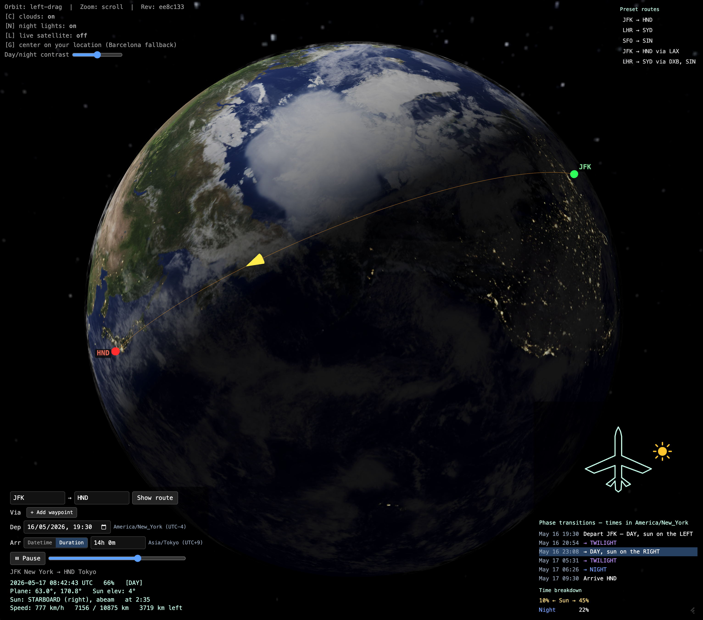

# 3D Earth Flight Viewer

An interactive 3D Earth in the browser that draws great-circle flight routes
between any two IATA airports, animates a plane along the route, and shows
where the sun is relative to the plane at every point (clock direction,
elevation, day / twilight / night).



**Live demo:** <https://brew-your-own.github.io/3d-earth-sunflight/>

## Why I built this

[sunflight.org](https://sunflight.org) — the site went dark recently, and
I wanted to see if I could build something similar quickly with the latest
Claude Code. This was really a personal project to play with the technology
outside my normal wheelhouse (I'm normally more of a backend guy). It turns
out it only took a couple of hours to get this done, which is incredible.

This is not meant to be 100% reliable: the results look credible but I haven't
verified them extensively. It matches closely what [flightside.app](https://flightside.app)
does on the few tests I ran. I built it to scratch an itch — it is only a fun toy.

## Features

- Textured Earth (day map, night lights, normal map, clouds) on a tilted axis,
  with a Milky Way starfield background
- Great-circle route between two airports (~9 000 IATA codes built in)
- Plane animated along the route using slerp interpolation
- Real subsolar-point computation (NOAA formula, ~0.01° accuracy) so the sun
  direction is correct for the actual flight time
- Recap table of day / twilight / night and sun left / right transitions, in
  the departure airport's local timezone
- Optional live cloud overlay from NASA GIBS satellite imagery (press `L`)
- Contrast slider for daylight / night intensity; `C` toggles clouds, `N`
  toggles night shading

## Run it locally

```bash
npm install
npm run dev      # http://localhost:5173
```

## Build

```bash
npm run build    # chunked production build → dist/  (suitable for web hosting)
npm run package  # single self-contained dist/index.html (~5 MB, double-clickable)
```

The single-file build inlines all textures and the airport database as base64,
so the resulting HTML runs from disk with no server and no network (except for
the optional live-satellite overlay).

## Credits & license

- [CREDITS.md](CREDITS.md) — data sources, textures, inspiration
- [LICENSE](LICENSE) — Apache-2.0 (code) + CC BY 4.0 (bundled Earth textures)
